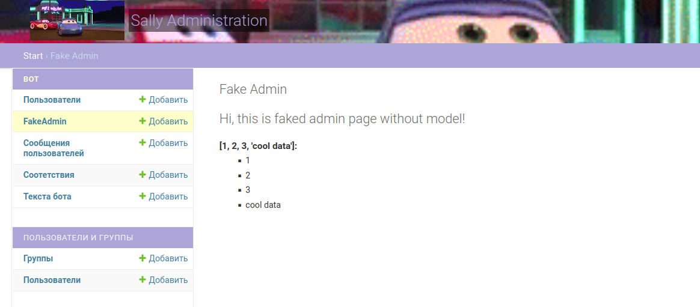
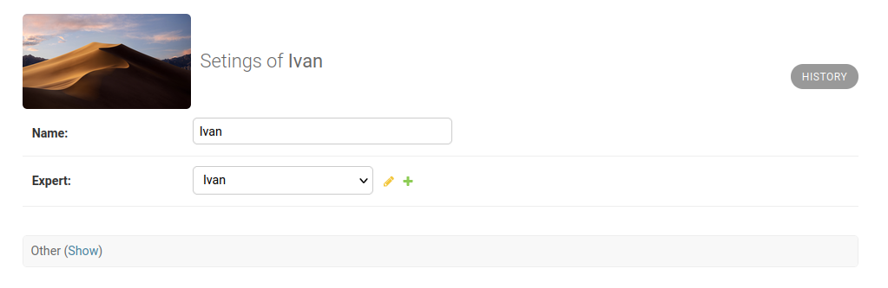

# Django3 hacks

This is my repository with all django hacks that I found useful and not very obvious

## Custom admin page / Fake admin page

This is an easy(probably the easiest) and native-like method to create statistics pages, specific managment forms or anything you would like directly in your django administration without need for additional models

## Admin change form avatar

A cool template to display basically any image in model's change form

## Auto image optimiser

## Stats view?

## Useful links

[Django statistics dashboard tutorial](https://hakibenita.com/how-to-turn-django-admin-into-a-lightweight-dashboard)
